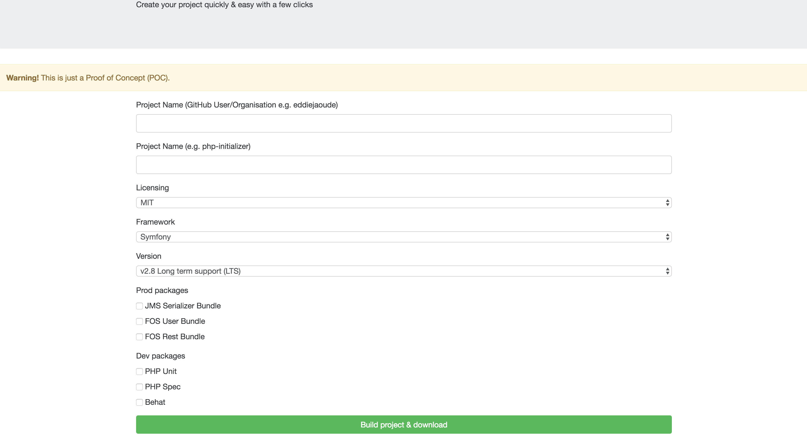

# PHP Initializer

**Note: this is just a Spike / Prototype / Proof of Concept**

Quickstart to Symfony project creator. Click on the options you require.

 * Owner/Namespace (eg. eddiejaoude)
 * Project name (eg. php-initializer)
 * Framework (eg. Symfony)
 * Framework version (eg. 1.8)
 * Production dependencies (eg. JMS Serialiser)
 * Development dependencies (eg. Behat)

 Then download the zip archive of your project

---

## Installation

1. Clone the project 
